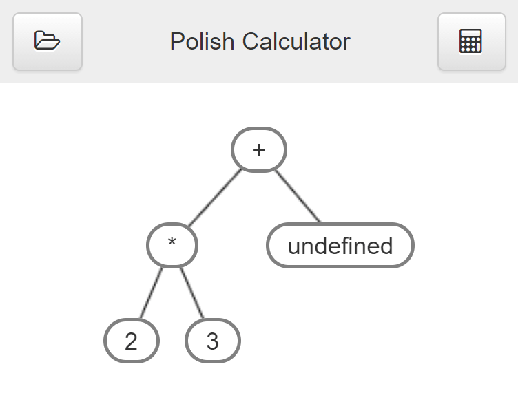
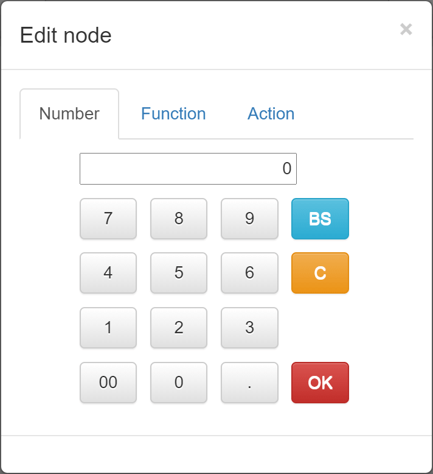
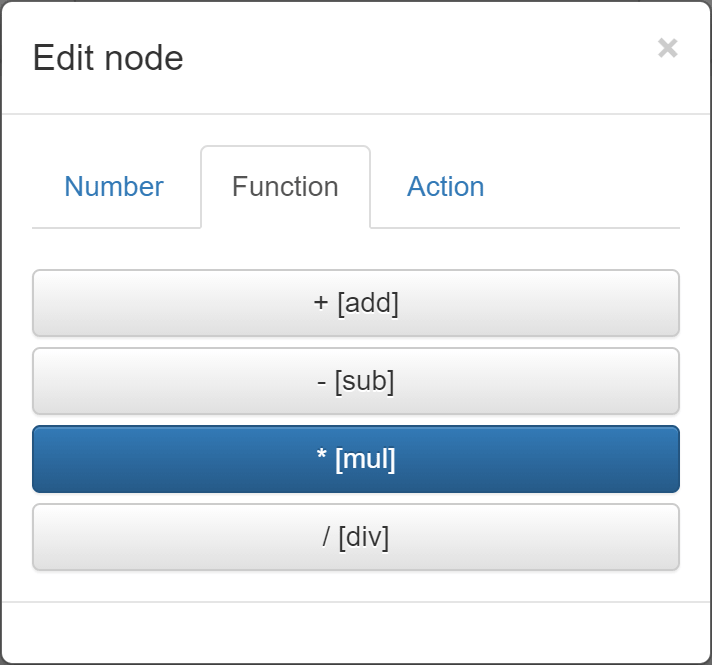
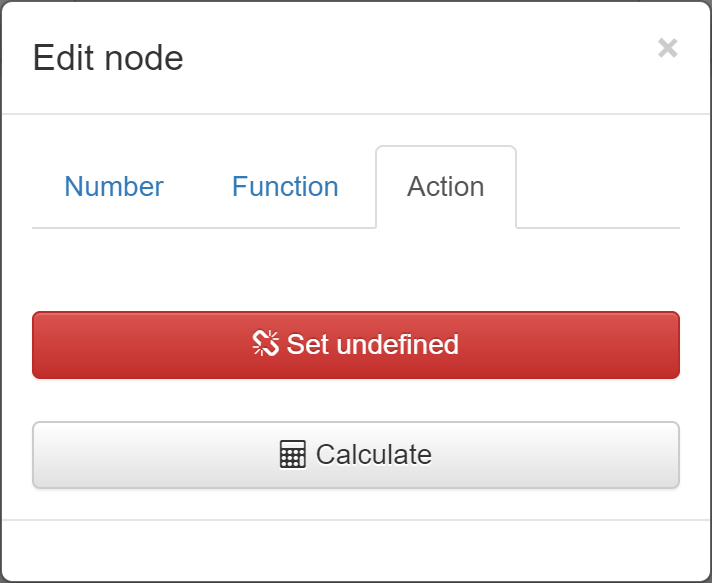

Polish Calculator
=================
visual polish calculator

* [Demo](https://yamahei.github.io/polish/index.html)

Overview
--------

* 昔作ったものが出てきたので公開
* 四則演算の構文木で遊ぶツール
* 計算の流れが目に見えるのでイメージが湧くかも
* 部分木から下だけ実行することもできる
* 作った構文木が保存できる（力技…）

Usage
-----

### 画面

📁セーブ/ロード
* 作成した構文木の保存と読込が出来ます。

🖩計算
* 作成した構文木全体を計算します。

(+)ノード
* 構文木を構成します。数値、演算子、undefinedのいずれかが入ります。
* クリックすると[ダイアログ](#ダイアログ)を開きます。

### ダイアログ

* 数値を入力します。

* 演算子を入力します。

* undefinedを入力します（配下ノードも消えます）。
* 現在の枝を計算します。